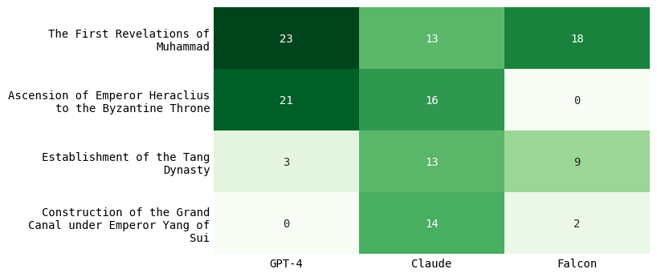

# World history through the lens of AI
Probing 3 different LLMs (in 6 different langauges) for their interpretation of major historical events.

Repository includes the data and analysis done for the corresponding blog post.

## Sample of analyses

*Major events predicted by LLMs for 610*

*Major events predicted by LLMs for 1848*

*Major events predicted by LLMs for 1910*